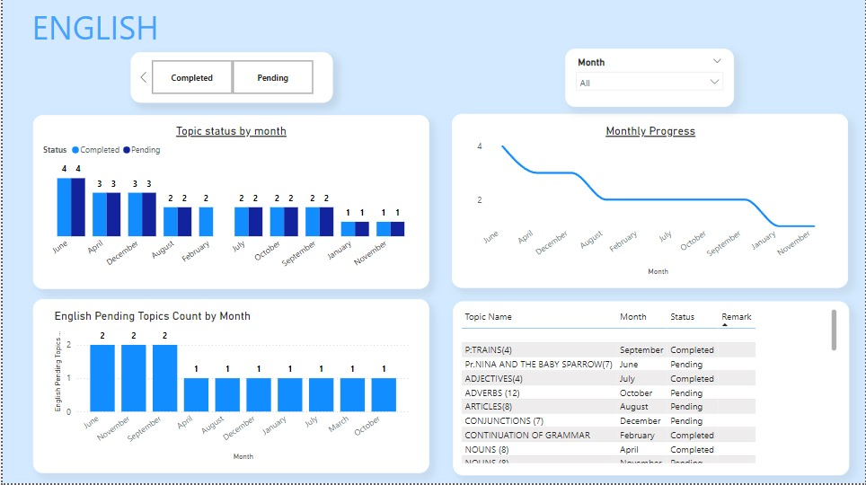
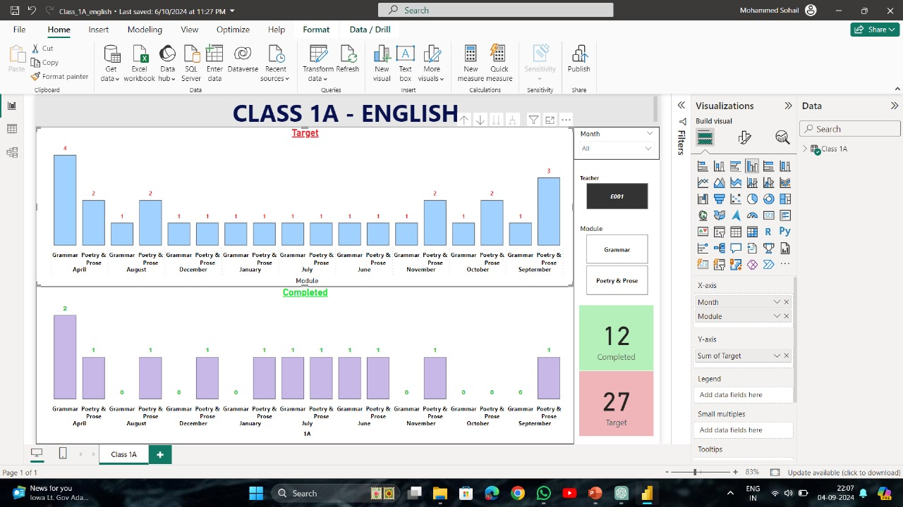

# 📘 Syllabus Tracker – SVKM's International School

A Power BI + Excel-based dashboard system currently used by SVKM’s International School to track syllabus coverage class-wise and subject-wise.

---

## 🎓 Project Overview

The **Syllabus Tracker** is an academic project developed to streamline and modernize the tracking of academic progress in schools. Designed specifically for **SVKM's International School**, this system provides a real-time overview of syllabus completion, ensuring efficient planning and execution.

Say goodbye to scattered spreadsheets—this integrated solution ensures all data is visual, centralized, and actionable.

---

## ✨ Key Features

- ✅ Class-wise and Subject-wise syllabus tracking  
- 📊 Target vs Completed visualizations  
- 📅 Monthly analysis and filtering  
- 🧾 Topic-wise status with remarks  
- 🧠 Insights into pending workload  
- 🌐 Cloud-deployed and shareable dashboards  

---

## 🧱 Tech Stack

- **Microsoft Excel** – Structured backend data input  
- **Power BI Desktop** – Dashboard creation  
- **Power BI Service** – Cloud deployment for web access  

---

## 🖼️ Sample Dashboards

| 🎯 Target & Completion Overview | 📅 Monthly Progress & Pending Topics |
|------------------------------|--------------------------------------|
|  |  |

---

- 📄 download the [Dashboard_links.pdf](./Dashboard_links.pdf) for all links

---

